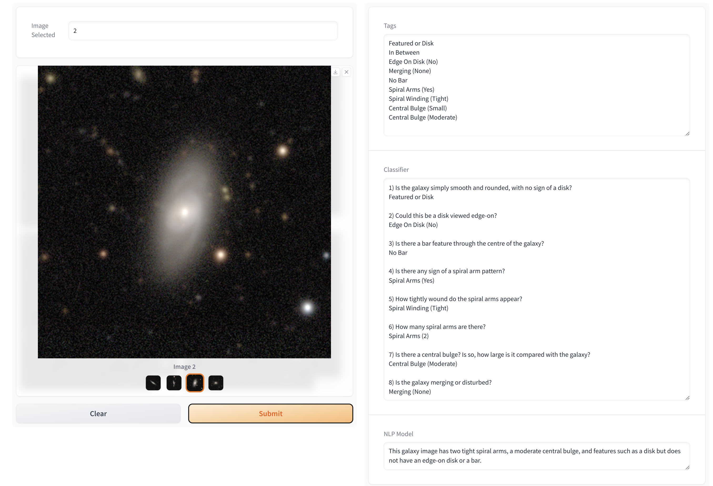

# GalaxyGenius

Application to classify galaxies and describe them using NLP.


<html lang="en">
<head>
<meta charset="UTF-8">
<meta name="viewport" content="width=device-width, initial-scale=1.0">
</head>
<body>

<!-- First Image -->


<!-- Second Image -->


</body>
</html>

## Docker

```
docker build -t galaxygenius . -f Dockerfile
docker run -d -p 8000:8000 galaxygenius
```

The application should then be available at

```
http://localhost:8000/gradio/
```

and if we want to make it publicly available,

1) create a tunnel on ngrok account
2) launch application on docker (as above)
3) in a screen, we then do `ngrok tunnel --label edge=xxx http://localhost:8000`

where xxx is obtained from the ngrok profile.